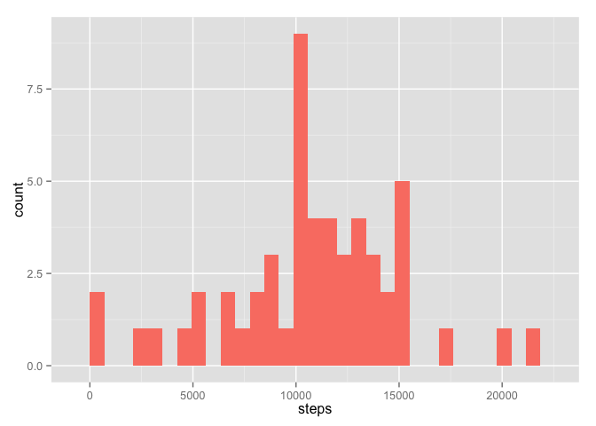

# Reproducible Research: Assignment 1
Zaman Forootan  
October 17, 2015  

## Loading and preprocessing the data
### 1. Load the data
In this part we assume that the zip file is saved to a folder named data in our working directory. Then it should be unziped to its *.csv* format.


```r
setwd("data/")
system(paste("unzip", "activity.zip"))
setwd("../")
```

Now that the data is saved as a *.csv* we can load the data using `read.csv()`.


```r
activity.D.F=read.csv("data/activity.csv")
```

### 2. Process/transform the data (if necessary) into a format suitable for your analysis
Then we need to transform the date column (currently having class `Factor`) to `Data` format readable by *R*.

```r
activity.D.F$date=as.Date(activity.D.F$date,format="%Y-%m-%d")
```

## What is mean total number of steps taken per day?
### 1. Calculate the total number of steps taken per day
In this part using `!duplicated`, we first create a data frame that the first column shows the days. THen using a for loop the sum of steps for each day is saved to the second column of the data frame.

```r
days=activity.D.F[!duplicated(activity.D.F[,2]),2]
Steps=as.data.frame(cbind(days,rep(NA,length(days))))
for(day in days){
       Steps[Steps[,1]==day,2]=sum(activity.D.F[activity.D.F[,2]==day,1])
}
Steps$days=as.Date(Steps$days,origin = "1970-01-01")
names(Steps)[2]="steps"
```
### 2. Make a histogram of the total number of steps taken each day
Now, we can use `ggplot2` to create the histogram.

```r
library(ggplot2)
h=ggplot(data = Steps,aes(x=steps))
h=h+geom_histogram(fill="Salmon")
h
```

```
## stat_bin: binwidth defaulted to range/30. Use 'binwidth = x' to adjust this.
```

 

### 3. Calculate and report the mean and median of the total number of steps taken per day
The following two simple functions can be used to calculate mean and median.

```r
Mean_steps=mean(Steps$steps,na.rm = T)
Mean_steps
```

```
## [1] 10766.19
```

```r
Median_steps=median(Steps$steps,na.rm = T)
Median_steps
```

```
## [1] 10765
```

## What is the average daily activity pattern?
### 1.Make a time series plot (i.e. type = "l") of the 5-minute interval (x-axis) and the average number of steps taken, averaged across all days (y-axis)
Using the following code we can graph the average number of steps during a day.

```r
interval=activity.D.F[!duplicated(activity.D.F[,3]),3]
Int_steps=as.data.frame(cbind(interval,rep(NA,length(interval))))
for (i in interval){
        Int_steps[Int_steps[,1]==i,2]=mean(activity.D.F[activity.D.F[,3]==i,1],na.rm = T)
}
names(Int_steps)[2]="mean.steps"
l=ggplot(data = Int_steps,aes(x=interval,y=mean.steps))
l=l+geom_line(color="blue")
l
```

 

### 2. Which 5-minute interval, on average across all the days in the dataset, contains the maximum number of steps?
A simple `max` function can be used to calculate this part:

```r
Int_steps[Int_steps[,2]==max(Int_steps[,2]),1]
```

```
## [1] 835
```

## Imputing missing values
### 1. Calculate and report the total number of missing values in the dataset
To calculate the number of missing values we can use a combination of `sum()` and `is.na()` functions as follows:

```r
sum(is.na(activity.D.F$steps))
```

```
## [1] 2304
```

### 2. Devise a strategy for filling in all of the missing values in the dataset.
We are going to use the average number of steps for each interval across all days to be replaced for missing values.

```r
impute.mean <- function(x) replace(x, is.na(x), mean(x, na.rm = TRUE))
```

### 3. Create a new dataset that is equal to the original dataset but with the missing data filled in.
Now using  `ddply' in `plyr` package, we are going to impute the mean values for `NA` values.

```r
library(plyr)
activity.dat2 <- ddply(activity.D.F, ~ interval, transform, steps = impute.mean(steps))

activity.dat2=activity.dat2[order(activity.dat2$date), ] #plyr orders by group so we have to reorder
```

### 4. Make a histogram of the total number of steps taken each day and Calculate and report the mean and median total number of steps taken per day. Do these values differ from the estimates from the first part of the assignment? What is the impact of imputing missing data on the estimates of the total daily number of steps?
Here again we use the same functions for the histogram and means as we used above:


```r
#Calculating the total number of steps
Steps2=as.data.frame(cbind(days,rep(NA,length(days))))
for(day in days){
       Steps2[Steps2[,1]==day,2]=sum(activity.dat2[activity.dat2[,2]==day,1])
}
Steps2$days=as.Date(Steps2$days,origin = "1970-01-01")
names(Steps2)[2]="steps"
#Ploting the histogram

h2=ggplot(data = Steps2,aes(x=steps))
h2=h2+geom_histogram(fill="Salmon")
h2
```

```
## stat_bin: binwidth defaulted to range/30. Use 'binwidth = x' to adjust this.
```

 

```r
# Calculating MEAN and MEDIAN
Mean_steps2=mean(Steps2$steps)
Mean_steps2
```

```
## [1] 10766.19
```

```r
Median_steps2=median(Steps2$steps)
Median_steps2
```

```
## [1] 10766.19
```

Here as it is shown the mean and mdeian are equal. 

## Are there differences in activity patterns between weekdays and weekends?

### 1. Create a new factor variable in the dataset with two levels – “weekday” and “weekend” indicating whether a given date is a weekday or weekend day.
We are going to use a combination of `weekdays` and `%in%` to make the required the factor varible and merge it as the fourth column to our data frame.

```r
activity.dat2[weekdays(activity.dat2$date)%in% c("Saturday", "Sunday"),4]="Weekend"
activity.dat2[!(weekdays(activity.dat2$date)%in% c("Saturday", "Sunday")),4]="Weekdays"
activity.dat2[,4]=as.factor(activity.dat2[,4])
names(activity.dat2)[4]="weekdays"
```

### 2. Make a panel plot containing a time series plot of the 5-minute interval (x-axis) and the average number of steps taken, averaged across all weekday days or weekend days (y-axis).


```r
summary.steps=ddply(activity.dat2,.(weekdays,interval),summarise,mean.step=mean(steps))
l2=ggplot(data = summary.steps,aes(x=interval,y=mean.step))
l2=l2+geom_line(col="blue")
l2=l2+facet_grid(~weekdays)
l2
```

 


